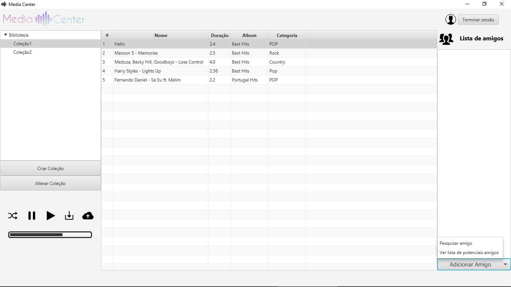

# Media Center
> Projeto de DSS 19/20



## Requisitos

- Maven
- Java 11 ou superior
- MySQL 8 ou superior
- VLC

## Setup

1. Copiar a pasta `csv` para a pasta do MySQL.
2. Correr o script `create.sql`. 
3. Correr o `popular.sql`.

### Notas

Existe uma classe `UTILITIES.CONSTANTS` que tem uma variavel `DATABASE_URL` que é preciso alterar a parte da password para consoante o nosso programa.

Podemos saber qual é a pasta do MySQL correndo:

```sql
SHOW VARIABLES LIKE "secure_file_priv";
```

## Desenvolvimento

```
mvn clean compile exec:java
```

## Disclaimer 
This is not a final product.

